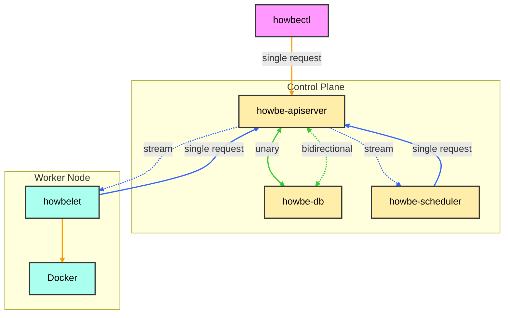

# h9s (howbernetes)

## Overview

h9s (howbernetes) is a simplified implementation of Kubernetes, designed as a learning project to gain deep insights into container orchestration and distributed systems. 

The primary goals of this project are:

1. **Developing Systems Design Experience**
   - Face challenges in designing a system similar to Kubernetes to improve architectural skills
   - Learn about trade-offs in scalability and reliability

2. **Enhancing Problem-Solving Skills**
   - Tackle complex problems, with a particular focus on state management

Through this project, I aim to deepen my understanding of distributed systems architecture and hone my ability to solve intricate technical challenges.

## Components

The h9s architecture consists of the following main components:

1. **Control Plane**:
   - **howbe-apiserver**: The central management entity that processes API requests.
   - **howbe-db**: Stores the cluster's state information.
   - **howbe-scheduler**: Assigns pods to nodes.

2. **Worker Node**:
   - **howbelet**: Manages containers on each node.
   - **Docker**: The container runtime.

3. **External Component**:
   - **howbectl**: Command-line interface for interacting with the cluster.

## Architecture

Communication between components is color-coded:
- Orange lines: HTTP 1.1 single requests
- Green lines: gRPC communication (unary and bidirectional)
- Blue lines: Server-Sent Events (SSE) for streaming updates

## Getting Started

To use h9s, you'll need to set up the control plane on one local machine and the worker node on another. For detailed setup and running instructions, please refer to the README files in the respective directories:

- [Control Plane Setup](./control-plane/README.md)
- [Worker Node Setup](./worker-node/README.md)

These README files contain all the necessary information to get each component up and running, as well as instructions for connecting the worker node to the control plane.

## howbectl

howbectl is the command-line interface for interacting with your h9s cluster. It's similar to kubectl in Kubernetes, allowing you to manage and inspect your cluster resources.

For detailed information on installing, configuring, and using howbectl, please refer to its dedicated README:

- [howbectl Setup and Usage](./howbectl/README.md)

The howbectl README provides comprehensive instructions on how to get started with the CLI tool, including installation, basic commands, and examples of common operations.